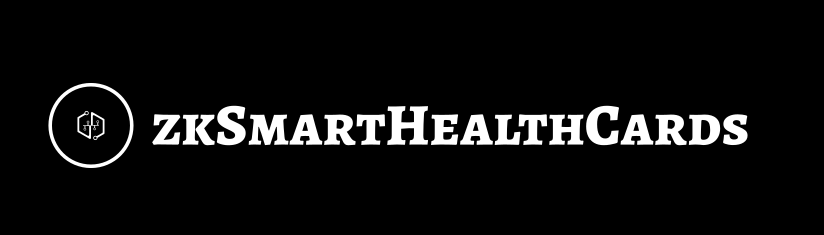

 

zkSMARTHealthCards is a zero-knowledge proof based solution to protect your privacy in Covid-19 SMART Health Card.
You can only certify the results of COVID-19 vaccination without disclosing any personal information.

The Covid-19 SMART Health Card is a type of [SMART Health Cards](https://smarthealth.cards) that certifies COVID-19 vaccination or test results issued by an agency accredited by the Verifiable Clinical Information Coalition (VCI). SMART Health Cards are the international standard for verifying versions of your clinical information, such as vaccination history or test results.

This project is currently on [Polygon Matic network](https://polygon.technology/solutions/polygon-pos/) and frontend is hosted on [Vercel](https://vercel.com/).

zkSMARTHealthCards Link

https://zkshc.vercel.app

Demo Video

Slide

## Problems with the current Covid-19 SMART Health Cards

To prove the results of COVID-19 vaccination with Covid-19 SMART Health Cards, you would show a certificate (QR code or app screen) issued by a VCI-authorized organization.

This certificate contains personal information such as name, date of birth, and the municipality that issued it.

For example, at an event or restaurant, you only need to certify the results of COVID-19 vaccination, and in many cases you do not need to disclose your personal information.

## Our Solution With Semaphore

[Semaphore](https://semaphore.appliedzkp.org/) allows Ethereum users to prove their membership of a group and send signals such as votes or endorsements without revealing their original identity. 

With their circuits and verification system on smart contracts, zkSMARTHealthCards enables users prove their membership of particular COVID-19 immunization group without revealing their personal information.

## Project Structure
The project has three main folders within root directory:

* contract/
* frontend/

### contract
The contract folder contains all the smart contracts used in zkSMARTHealthCards.

### frontend
The frontend folder contains frontend files  built with [Nextjs](https://nextjs.org/).

## Process

1. Connect wallet
2. If not yet, sign and generate Semaphore Identity for the proof system.
3. Create an immunization group
   1. Users need to send a transaction to create immunization data on chain.
4. Join an immunization group
   1. Check if the user is eligible to join the immunization group, which means the user have a valid SMARTHealthCards, and if eligible, user make a transaction to add a Identity to the MerkleTree on chain.
5. Generate a zk proof
   1. Make a MerkeTree inclusion proof.
6. Verify the zk proof

## Deployed contracts

### Polygon Mumbai

| Name | Contract Address | Status |
| ---- | ---- | --- |
| zkSMARTHealthCards| 0xCf7Ed3AccA5a467e9e704C703E8D87F634fB0Fc9 | Verified |
| Verifier| 0x9fE46736679d2D9a65F0992F2272dE9f3c7fa6e0 | Verified |
